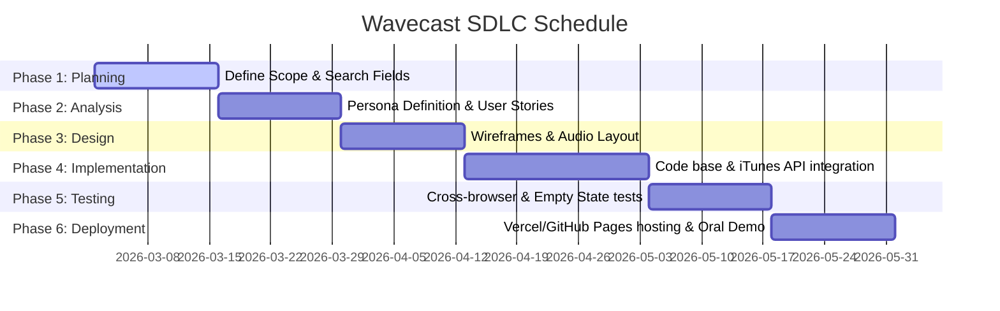

# Project Timeline and SDLC Schedule
## Wavecast — Podcast Explorer
**FUTM-SWE-221 | Group 17 Project**

The project follows a structured Software Development Life Cycle (SDLC) spanning a 12-week academic semester. Below is the timeline indicating start dates, durations, and outcomes for each phase.

---

## 1. SDLC Phase Breakdown

---

## 2. Milestone Details

### Phase 1: Planning (Weeks 1 – 2)
* **Start Date:** 2026-03-02
* **Deliverables:** Draft Project Proposal, Defined search terms, and iTunes API research.
* **Milestone:** Alignment on scope and approval from course coordinator.

### Phase 2: Analysis / Requirements (Weeks 3 – 4)
* **Start Date:** 2026-03-16
* **Deliverables:** Commuter Persona document, 5 core user stories, and feature prioritization grid.
* **Milestone:** Finalization of Product Requirements Document (PRD).

### Phase 3: Design (Weeks 5 – 6)
* **Start Date:** 2026-03-30
* **Deliverables:** Wireframes for search listings and audio player bar layouts, CSS layout tokens, and color palettes.
* **Milestone:** Design approval and Figma/wireframe freezes.

### Phase 4: Implementation / Coding (Weeks 7 – 9)
* **Start Date:** 2026-04-13
* **Deliverables:** Codebase structure (`index.html`, `css/`, `js/`), iTunes API connection, CORS proxy implementation, native player logic.
* **Milestone:** Feature-complete software prototype.

### Phase 5: Testing (Weeks 10 – 11)
* **Start Date:** 2026-05-04
* **Deliverables:** Test case matrix, empty search testing, slow connection performance tests, and CORS fallback checks.
* **Milestone:** Zero critical bug status.

### Phase 6: Deployment & Oral Demo (Week 12)
* **Start Date:** 2026-05-18
* **Deliverables:** Live URL hosted on GitHub Pages or Vercel, User Manual, slide presentation, and live classroom demo.
* **Milestone:** Final project submission.
